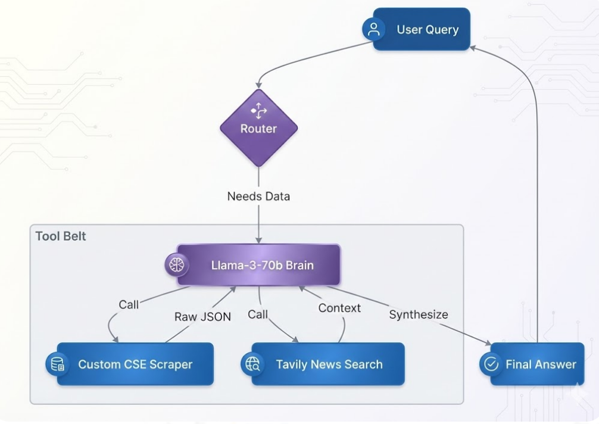

# CSE Smart Scout: Agentic Financial Analyst


> **A latency-optimized, autonomous AI agent that performs real-time technical analysis and news synthesis for the Colombo Stock Exchange (CSE).**

---

## 🚀 The Problem
The Sri Lankan financial market suffers from a **Data Accessibility Gap**.
1.  **No Public API:** The CSE does not offer a modern public API for developers.
2.  **Context Blindness:** Generic LLMs (like ChatGPT) hallucinate when asked about local stocks, often confusing "Dialog Axiata" with "Dialog Semiconductor" or mixing Sri Lankan news with Indian/Pakistani market updates.
3.  **Stale Data:** Standard libraries like `yfinance` frequently return incomplete or delisted data for the CSE.

## 💡 The Solution
**CSE Smart Scout** is a custom-built **ReAct Agent** that bypasses these limitations. Instead of relying on static datasets, it acts as a digital research assistant that:
* **Observes** user intent (e.g., "Compare JKH and DIAL").
* **Plans** a sequence of actions (Fetch Price A -> Fetch Price B -> Search News -> Synthesize).
* **Executes** using custom-built tools.
* **Corrects** itself if data is missing or ambiguous.

---

## 🧠 Engineering Journey: Challenges & Solutions
*This project was not just about connecting APIs; it was about engineering resilience.*

### Challenge 1: The "Black Box" Data
**The Failure:** My initial attempt using `yfinance` failed because CSE tickers on Yahoo are often outdated or mapped incorrectly (e.g., missing the `.N0000` suffix).

**The Engineering Solution:**
I performed **Network Traffic Analysis** on the official `cse.lk` website using browser developer tools. I identified their internal private API endpoints, reverse-engineered the payload structure, and wrote a custom Python wrapper (`cse_tools.py`) that mimics a legitimate browser session (Stealth Headers) to fetch tick-by-tick data directly from the source.

### Challenge 2: Hallucination
**The Failure:** When asked about "Dialog", the agent would often return news about the Sri Lankan Cricket Team (sponsored by Dialog) or unrelated companies in Pakistan (due to keyword overlap in generic news scrapers).

**The Engineering Solution:**
I implemented a multi-layered filtering system:
1.  **Fuzzy Symbol Resolution:** A mapped dictionary converts loose terms ("John Keells", "JKH", "Keells") into strict ticker symbols (`JKH.N0000`) before the tool is even called.
2.  **Strict System Prompts:** Injected a "Context Guardrail" into the LLM's system message: *"If news relates to Cricket or Pakistan, ignore it."*
3.  **Switch to Tavily:** Migrated from generic scraping (DuckDuckGo) to **Tavily AI Search**, utilizing its `topic="news"` parameter to prioritize financial domains over general web noise.

### Challenge 3: Inference Latency
**The Failure:** Chaining sequential tool calls (Price -> News -> Analysis) with GPT-4 resulted in 10+ second wait times, which is unacceptable for a trading assistant.

**The Engineering Solution:**
I switched the inference engine to **Llama-3-70b via Groq's LPU (Language Processing Unit)**. This hardware is optimized for token generation speed. I also leveraged LangGraph's architecture to allow **Parallel Function Calling**, enabling the agent to fetch prices for multiple stocks simultaneously rather than sequentially.

---

## 🏗️ Architecture



---

## 🛠️ Tech Stack

| Component        | Technology        | Reasoning |
|------------------|-------------------|-----------|
| Orchestration    | LangGraph         | Enables cyclic, stateful workflows (loops) which are superior to linear chains for complex reasoning. |
| Inference        | Groq LPU          | Near-instant inference speed (~300 tokens/sec) for real-time responsiveness. |
| Model            | Llama-3.3-70b     | The sweet spot between reasoning capability (comparable to GPT-4) and open-source availability. |
| Frontend         | Streamlit         | Provides a "Glass Box" UI where users can expand the "Reasoning" tab to see the agent's thought process. |
| Search           | Tavily API        | Optimized specifically for RAG/Agents, reducing noise in search results. |

---

## ⚡ Quick Start

### Prerequisites
- Python 3.10+
- API Keys for Groq and Tavily

### Installation

1. Clone the repo:
    ```bash
    git clone https://github.com/yourusername/cse-smart-scout.git
    cd cse-smart-scout
    ```

2. Install dependencies:
    ```bash
    pip install -r requirements.txt
    ```

3. Configure Environment:  
   Create a `.env` file in the root directory:
   ```plaintext
   GROQ_API_KEY=gsk_...
   TAVILY_API_KEY=tvly-...
   ```

4. Run the App:
   ```bash
   streamlit run app.py
   ```

---

## 📸 Example Workflow

**User**: "Compare the price of JKH and DIAL and tell me why JKH is moving."

**Agent Logic (Visible in UI)**:

- **PLAN**: Identify intent "Comparison".
- **ACTION**: Call `get_cse_stock_price("JKH")` AND `get_cse_stock_price("DIAL")` (Parallel Execution).
- **OBSERVATION**: Prices received.
- **ACTION**: Call `search_market_news("JKH financial news")`.
- **SYNTHESIS**: "JKH is trading at 21.0 (-0.4%) while DIAL is at 29.5. JKH's dip correlates with recent treasury bill yield volatility..."

## 🔮 Future Roadmap

- **Sentiment Analysis**: Integrate a BERT-based model to score news sentiment (Bullish/Bearish).
- **RAG Integration**: Connect to a vector database of CSE Annual Reports for "Deep Dive" questions.
- **WhatsApp Bot**: Deploy the `agent.py` logic via Twilio for mobile access.
