# CSE Smart Scout: Multi-Agent Financial Analyst


> **A hierarchical multi-agent system that orchestrates specialized AI workers to perform real-time technical analysis and market research for the Colombo Stock Exchange (CSE).**


---

## 🏗️ Architecture: The Supervisor Pattern

Unlike standard chatbots that use a single shared context, **CSE Smart Scout** utilizes a **Hierarchical Supervisor Architecture**. A top-level "Supervisor" agent acts as a router, delegating tasks to specialized worker agents and aggregating their outputs.

```mermaid
graph TD
    User(User Query) --> Supervisor{Supervisor Agent}
    Supervisor -->|Quant Task| Analyst[📉 Technical Analyst]
    Supervisor -->|News Task| Researcher[📰 Market Researcher]
    
    Analyst -->|Fetch Data| Tools[🛠️ CSE & Calc Tools]
    Researcher -->|Web Search| Tools
    
    Tools --> Analyst
    Tools --> Researcher
    
    Analyst -->|Summary| Supervisor
    Researcher -->|Summary| Supervisor
    
    Supervisor -->|Final Answer| Guardrail[🛡️ Compliance Node]
    Guardrail --> Output(Final Response)
```



---

## 🚀 The Problem
The Sri Lankan financial market suffers from a Data Accessibility Gap:
- **No Public API**: The CSE does not offer a modern public API for developers.
- **Context Blindness**: Generic LLMs (like ChatGPT) hallucinate when asked about local stocks, often confusing "Dialog Axiata" with "Dialog Semiconductor."
- **Regulatory Risk**: Standard AI agents lack "Guardrails," often providing hallucinated financial advice, which is a major compliance risk in Fintech.

## 💡 The Solution
CSE Smart Scout is not just a chatbot; it is an **Orchestrated Agent System**.
- **Specialized Workers**: Separates "Quantitative Analysis" (RSI, MACD) from "Qualitative Research" (News, Sentiment) to prevent context pollution.
- **Stateful Orchestration**: Uses LangGraph to maintain conversation state, allowing the Supervisor to loop through workers until the answer is complete.
- **Compliance First**: Includes a dedicated post-processing guardrail node that intercepts and sanitizes financial advice before it reaches the user.

## 🧠 Engineering Journey: Challenges & Solutions

### Challenge 1: The "Black Box" Data (Reverse Engineering)
- **The Failure**: Standard libraries like yfinance return incomplete or delisted data for the CSE.
- **The Solution**: I performed Network Traffic Analysis on the official cse.lk website. I identified their internal private API endpoints, reverse-engineered the payload structure, and wrote a custom Python wrapper (`cse_tools.py`) that mimics a legitimate browser session (Stealth Headers) to fetch tick-by-tick data directly from the source.

### Challenge 2: The "Hallucinating Tool" (Llama-3 Bias)
- **The Failure**: During testing, the Llama-3 model persistently tried to call a non-existent tool named `brave_search` instead of my custom search tool, causing validation crashes. This was due to the model's training bias.
- **The Solution**: I implemented a **Namespace Mapping Strategy**. Instead of fighting the model with prompts, I renamed my internal tool to `web_search` and bound it strictly within the Pydantic schema. This aligned the code with the model's internal "intuition," eliminating the hallucination immediately without degrading performance.

### Challenge 3: Infinite Loops in Agent Routing
- **The Failure**: The Supervisor agent would occasionally get stuck in a loop, endlessly asking the Analyst for the same data.
- **The Solution**: I engineered a **"Worker-Loop" Flow** with strict exit conditions:
  - **Self-Summarization**: Workers are forced to summarize their own tool outputs into English before passing control back.
  - **Pydantic Validation**: The Supervisor's routing logic is constrained by a strict `RouteResponse` schema, forcing it to choose between `Technical_Analyst`, `Market_Researcher`, or `FINISH`.
  - **Recursion Limits**: Configured the graph runtime to handle extended reasoning chains (up to 50 steps) for complex comparative queries.

## 🛠️ Tech Stack

| Component      | Technology           | Reasoning |
|----------------|----------------------|-----------|
| **Reasoning Orchestration** | LangGraph          | Enables cyclic, stateful multi-agent workflows (Supervisor-Worker pattern). |
| **Inference**  | Groq LPU             | Near-instant inference speed (~300 tokens/sec) for real-time agent routing. |
| **Model**      | Llama-3.3-70b        | Chosen for its superior instruction-following capability in complex routing tasks. |
| **Validation** | Pydantic             | Enforces structured output for the Supervisor, preventing routing errors. |
| **Search**     | Tavily API           | Optimized specifically for RAG/Agents to reduce noise in financial news search. |

---

## ⚡ Quick Start

### Prerequisites
- Python 3.10+
- API Keys for Groq and Tavily

### Installation

1. Clone the repo:
    ```bash
    git clone https://github.com/yourusername/cse-smart-scout.git
    cd cse-smart-scout
    ```

2. Install dependencies:
    ```bash
    pip install -r requirements.txt
    ```

3. Configure Environment:  
   Create a `.env` file in the root directory:
   ```plaintext
   GROQ_API_KEY=gsk_...
   TAVILY_API_KEY=tvly-...
   ```

4. Run the App:
   ```bash
   streamlit run app.py
   ```

---

## 📸 Key Features

- **Glass-Box Reasoning**: Users can expand the "Agent Logic" tab to see the live thought process: Supervisor routing, Tool execution, and raw JSON data.
  
- **Compliance Guardrails**: The system automatically detects risky keywords ("buy", "guarantee", "profit") and appends a regulatory disclaimer to the final output.

- **Multi-Stock Comparison**: The Supervisor autonomously parallelizes tasks, fetching data for multiple tickers (e.g., "Compare JKH and DIAL") in a single workflow.

## 🔮 Future Roadmap

- **Small Language Model (SLM) Optimization**: Quantize the worker agents to run on edge devices (Llama-3-8B) while keeping the Supervisor on the cloud.

- **RAG Integration**: Connect to a vector database of CSE Annual Reports for "Deep Dive" fundamental analysis.

- **WhatsApp Bot**: Deploy the `agent.py` logic via Twilio for mobile access.
